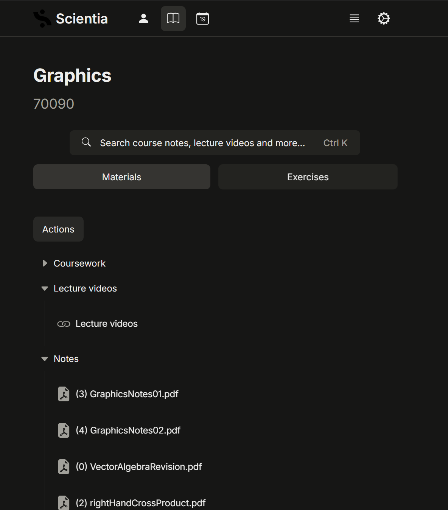

# Imperial-Scientia-Helper
A Chrome extension for downloading course materials from Scientia.

## Usage

1. Open Course Page (e.g. 70090 Graphics).

2. Click the "Imperial Scientia Helper" button.

3. Select all files you want to download and click the "Download Selected Files" button.

(Optional) You can select all desired formats through this filter.

## If you encounter any bugs or have any suggestions, please feel free to create issue and PR!!!