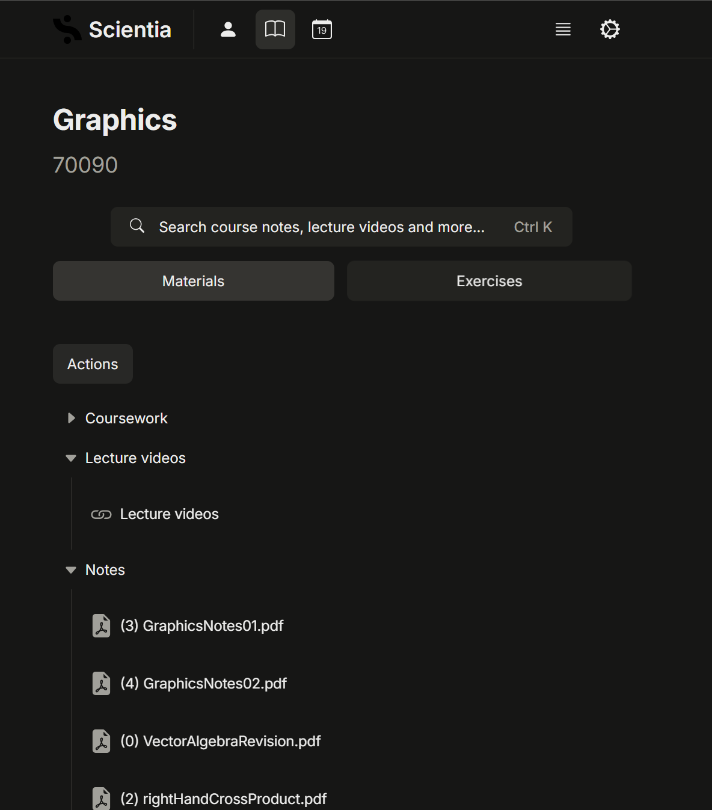
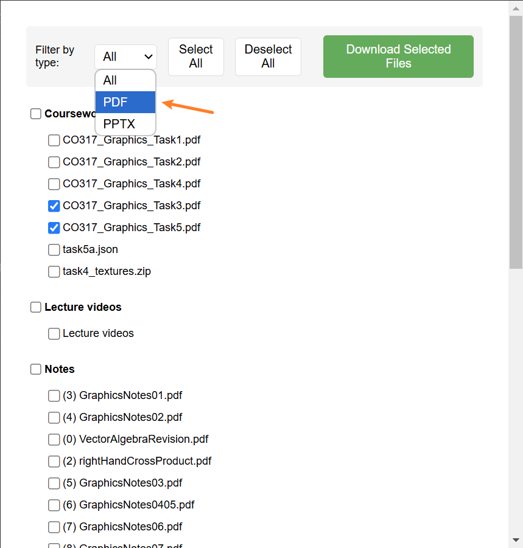
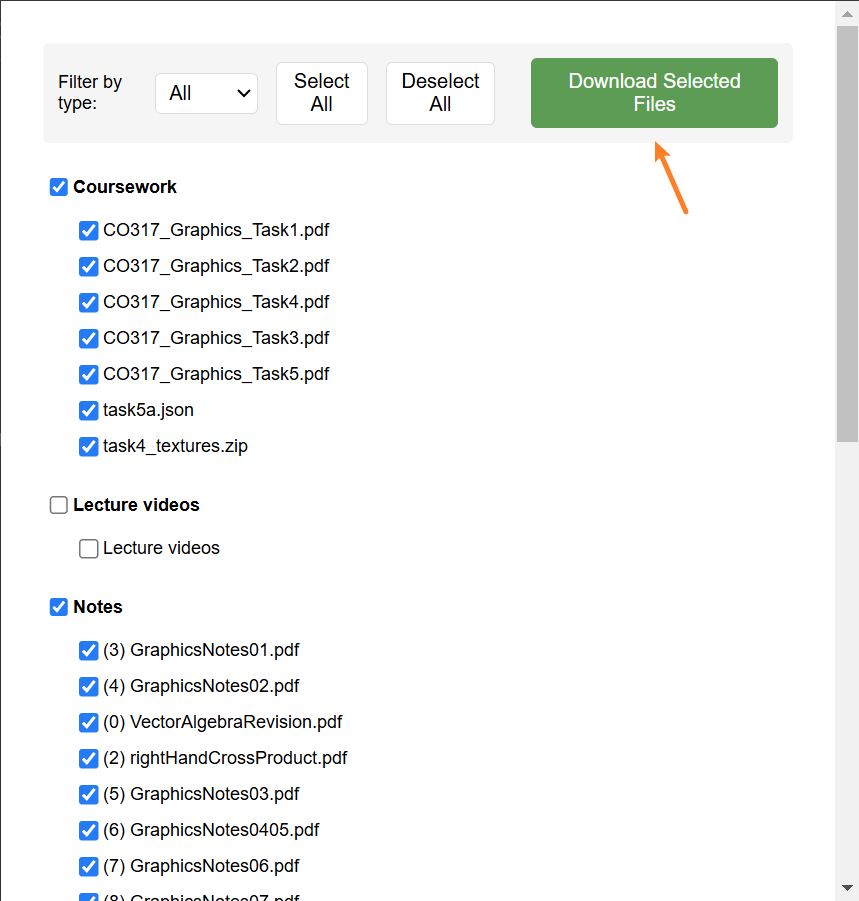

# Imperial Scientia Helper

A Chrome extension for batch downloading course materials from Imperial College London's Scientia platform.

## Features

- 🗂 Organize files by course sections
- 📁 Maintain original folder structure
- 🔍 Filter files by type (PDF, PPTX)
- 📦 Download selected files as a zip package
- ✨ Clean and intuitive user interface

## Installation

### Method 1: Install from .crx file (Recommended)
1. Download the latest `.crx` file from the [Releases](../../releases) page
2. Open Chrome and navigate to `chrome://extensions/`
3. Enable "Developer mode" in the top right
4. Drag and drop the `.crx` file into the Chrome extensions page
5. Click "Add extension" in the popup dialog

### Method 2: Install from source code
1. Download this repository
2. Open Chrome and navigate to `chrome://extensions/`
3. Enable "Developer mode" in the top right
4. Click "Load unpacked"
5. Select the downloaded code folder

## Usage

1. Navigate to a Scientia course page (e.g., 70090 Graphics `https://scientia.doc.ic.ac.uk`)
   
   

2. Click the "Imperial Scientia Helper" icon in your Chrome toolbar
   
   

3. In the popup window, select the files you want to download:
   - Use the filter at the top to select file types (PDF, PPTX)
   - Use "Select All" to quickly select all currently visible files
   - Select files by section using the section checkboxes
   
   

4. Click "Download Selected Files", choose a save location, and the download will begin
   
   

## Contributing

Contributions are welcome! If you find any bugs or have suggestions for improvements:

1. Open an issue to discuss the proposed changes
2. Submit a pull request with your improvements

## License

This project is licensed under the MIT License - see the [LICENSE](LICENSE) file for details.